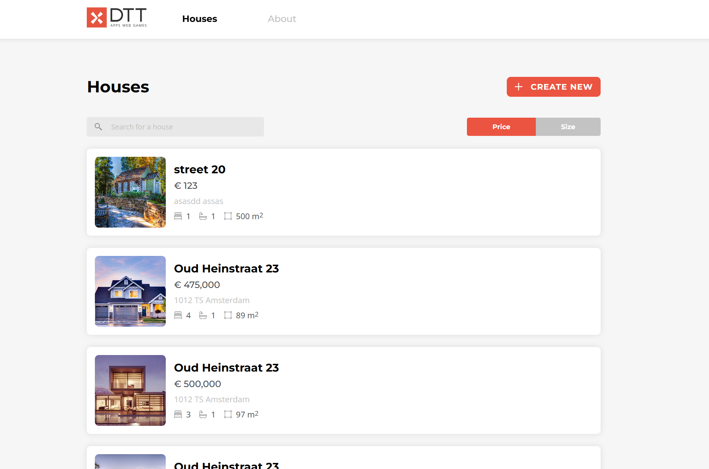
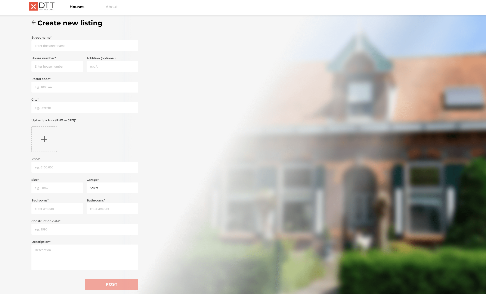
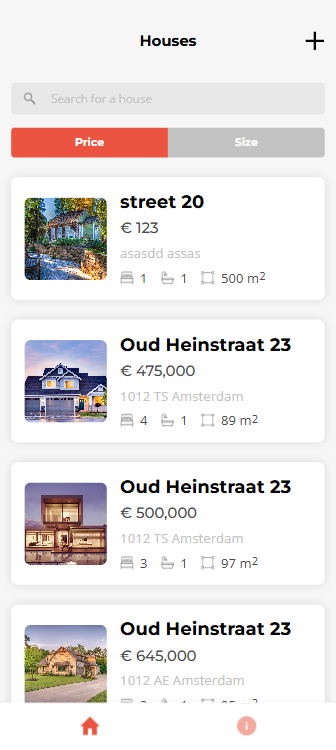
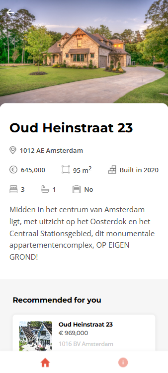
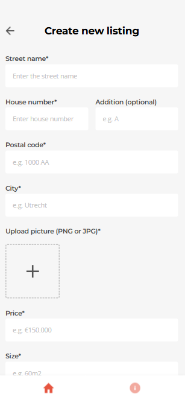

# DTT Real Estate

A house listing web application.

## Screenshots

### Houses Overview


### House Detail


### Create Listing


### Mobile
<p>
  
  
  
</p>
## Tech Stack

- Vue 3
- Vite
- Pinia
- Vue Router
- ESLint
- Prettier

## Features

- View all house listings from the DTT API
- Search houses by street, city, zip code or price
- Sort houses by price or size
- View detailed information about a house
- Create, edit and delete your own listings
- Recommended houses on the detail page
- About page with DTT information
- Mobile responsive design

## Project Setup

### Prerequisites

- Node.js
- npm

### Installation

```bash
npm install
```

### Run Development Server

```bash
npm run dev
```

The app runs on `http://localhost:8080`

### Build for Production

```bash
npm run build
```

### Lint

```bash
npm run lint
```

### Format

```bash
npm run format
```

## API

This project uses the DTT House API. An API key is required to access the endpoints.

